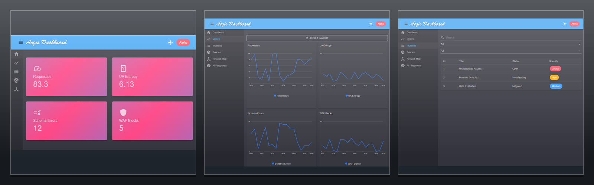

# AegisAPI – Secure API Gateway with AI Remediation

[](https://github.com/MatteoRigoni/aegisapi/actions/workflows/ci.yml)
[](https://github.com/MatteoRigoni/aegisapi/actions/workflows/codeql.yml)
[](https://github.com/MatteoRigoni/aegisapi/actions/workflows/sbom.yml)


**AegisAPI** is a zero-trust API security gateway built on **.NET 8 + YARP**, with **AI anomaly detection** and **OpenTelemetry observability** to keep your APIs safe, fast, and compliant.




## Quick Start

```bash
# Run the Summarizer service (dev)
cd src/ai/Summarizer
dotnet run --urls http://localhost:5290

# Run the gateway (in another terminal)
cd src/gateway
dotnet run --urls http://localhost:5000

# Test endpoints
curl http://localhost:5000/                             # Returns "AegisAPI Gateway up"
curl http://localhost:5000/healthz                      # Returns 200 OK
curl http://localhost:5000/api/ping                     # Public route
curl -H "Authorization: Bearer <token>" http://localhost:5000/api/secure/ping  # Protected route (JWT)
curl -H "X-API-Key: <key>" http://localhost:5000/api/secure/ping               # Protected route (API key)
curl http://localhost:5000/metrics                      # Prometheus metrics
```

## Docker

Run the gateway and summarizer with Docker Compose:

```bash
docker compose up --build
```

The gateway will be available at [http://localhost:5000](http://localhost:5000)
and the summarizer at [http://localhost:5290](http://localhost:5290).

The Summarizer exposes `POST /ai/summarize` and a `GET /seed/logs` helper that returns a sample `IncidentBundle` for quick experiments.

## Backend configuration

Backend service addresses and Summarizer settings are not set in `src/gateway/appsettings.json`.
Provide them via environment variables (e.g. `Summarizer:BaseUrl`, `Summarizer:InternalKey`) or manage them dynamically through the Control Plane.

## Authentication

AegisAPI supports two authentication modes:

- **JWT**: send a token in the `Authorization: Bearer <token>` header. For development, set the symmetric secret via `Auth:JwtKey` in `src/gateway/appsettings.Development.json`.
- **API key**: send the key in the `X-API-Key: <key>` header. For development, configure `Auth:ApiKeyHash` in the same file with the SHA-256 hash of the key (`echo -n your-key | sha256sum`).

### ✨ Features

- 🔐 **Authentication & Authorization** with JWT or API keys and claim-based policies

- 🚦 **Rate Limiting** with per-client token bucket and plan-aware limits

- 📑 **Schema Validation** for request and response bodies via JSON Schema

- 🛡 **WAF Protections** with regex checks for path traversal, SQLi, XSS, and SSRF

- 📉 **Anomaly Detection** with per-client and per-route rolling thresholds, normalized routes, HTTP method & UA entropy features, and optional ML.NET models (see [docs/anomaly-detection](docs/anomaly-detection.md))

- 🧠 **AI Incident Summaries** from a dedicated Summarizer service

- ♻️ **Resilience** with Polly-based retries, timeouts, and circuit breakers

- 📈 **Observability** with OpenTelemetry traces, metrics, and logs

## Control Plane API

Administrative CRUD endpoints live under `/cp/*` and include routes, rate limit plans, WAF toggles and API keys. Each write operation requires an `If-Match` header and returns the new `ETag`; mismatches yield `409 Conflict`. Every change is appended to an in-memory audit log retrievable via `GET /cp/audit`. The OpenAPI description is available from `/swagger/v1/swagger.json` and browsable at `/swagger`.

### 📈 Key Performance Indicators

- **p95 latency** ≤ 150ms  

- **Block accuracy** ≥ 98%  

- **False positives** ≤ 0.5%  

- **MTTR (Mean Time to Remediation)** < 15 minutes  


