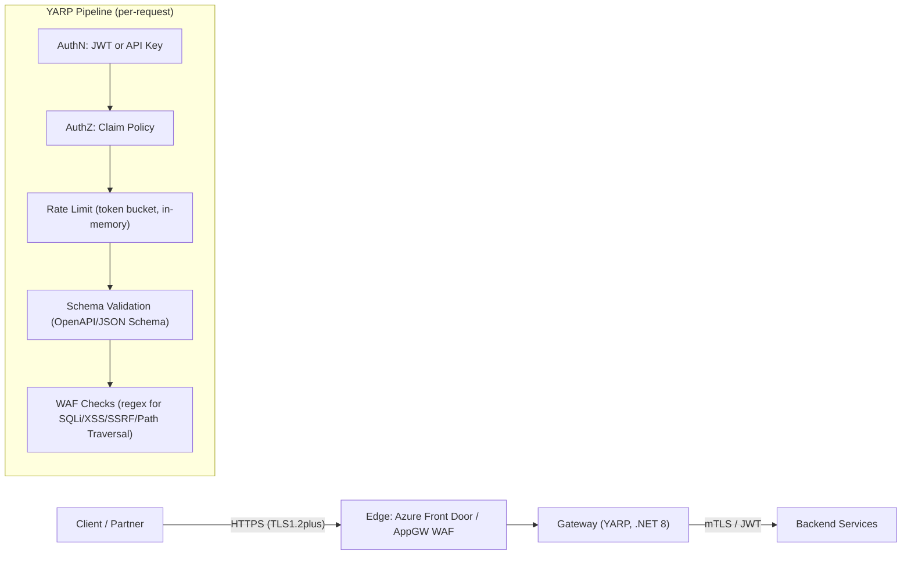
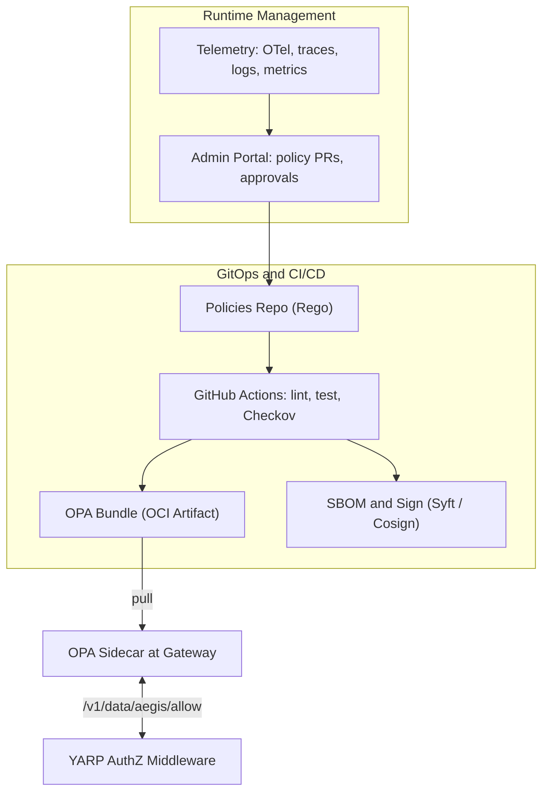
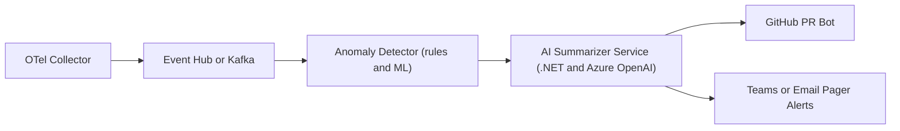
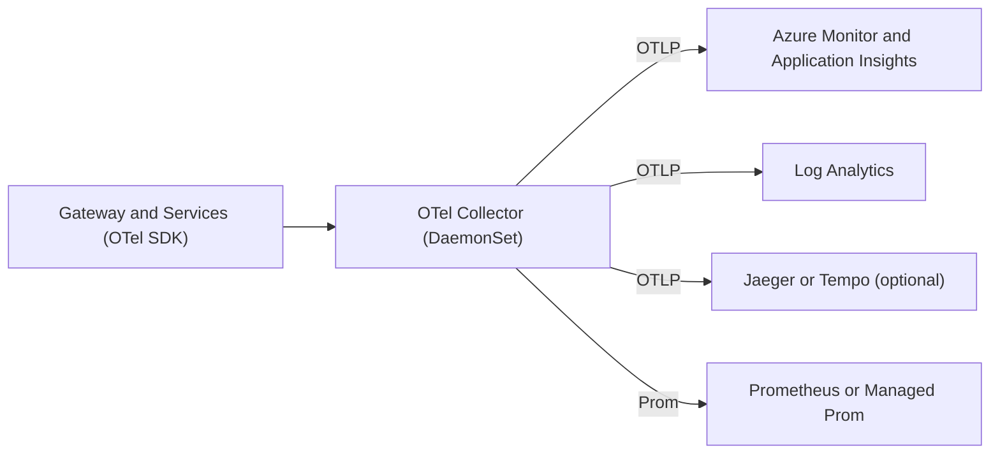

# AegisAPI — Architecture Overview

> An ASP.NET Core (.NET 8) + YARP security gateway with JWT/API key authentication, claim-based authorization, rate limiting, schema validation, WAF protections, anomaly detection, **AI incident summarization**, and end-to-end observability via OpenTelemetry. Future work includes OPA/Rego policies and Azure AD integration. Targets AKS for data plane, GitHub Actions for CI, Cosign/Trivy/CodeQL for supply chain, and Helm for delivery.

## 1) Request Flow (Data Plane)

### Notes

- **Authentication**: JWT bearer tokens or API keys. OIDC integration is planned.
- **Authorization**: simple claim-based policy. OPA sidecar is planned.
- **Rate Limiting**: in-memory token bucket.
- **Resilience**: outbound calls use Polly for retries, timeouts, and circuit breakers.

## 2) Control Plane & OPA Decision Point (planned)

### Notes

- Policies are versioned, tested, and published as bundles (OCI). Gateways pull bundles on start and periodically. 
- Decision point stays in the gateway (low latency, fail-closed with cached bundles). 

## 3) AI Summarizer Service

### Notes

- Summarizes incident context (recent request bundles) using an LLM.
- Can draft remediation PRs (e.g., tighten policy, add rate-limit, update schema). Requires human approval. *(planned)*

## 4) Telemetry (OpenTelemetry)

### Notes

- Unified tracing/metrics/logs with baggage/attributes scrubbed of PII.
- Tail-based sampling for high-QOS transactions.

### Security Controls (high level)

- **Zero Trust**: mutual TLS to backends; audience/issuer checks on JWTs. Azure AD app registrations are planned.
- **Defense in Depth**: Edge WAF + schema validation + rate limits. OPA policies are planned.
- **Secrets**: Azure Key Vault; CSI Secret Store in AKS; short-lived credentials.
- **Supply Chain**: Cosign-signed images & bundles, SBOM attestation; Trivy/Checkov/CodeQL in CI.
- **Isolation**: Namespaces & NetworkPolicies; minimal pod capabilities; read-only filesystem.

### Assumptions

- Azure subscription with AAD, AKS, Key Vault, Managed Grafana/Monitor available.
- Azure OpenAI access approved (deployment + responsible AI guardrails).
- Backends expose OpenAPI specs (>= 3.0) for validation.

### Trade-offs

- YARP (managed in-proc) vs Envoy (feature-rich xDS): simpler ops vs fewer native filters; OPA sidecar compensates.
- AKS vs ACA: AKS gives maximum control; higher ops overhead vs ACA.
- Dual WAF (edge + local): increases protection and complexity.
